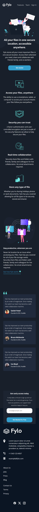
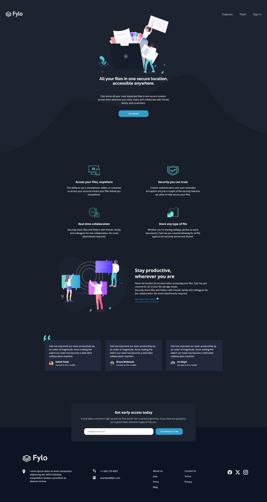
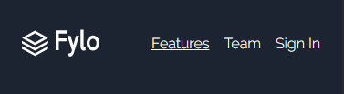
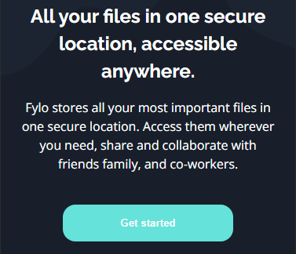
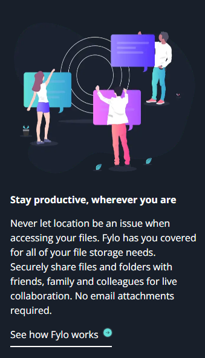
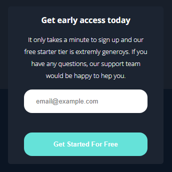
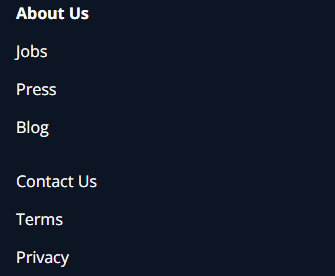

# Frontend Mentor - Fylo dark theme landing page solution

This is a solution to the [Fylo dark theme landing page challenge on Frontend Mentor](https://www.frontendmentor.io/challenges/fylo-dark-theme-landing-page-5ca5f2d21e82137ec91a50fd).

## Table of contents

- [Overview](#overview)
  - [The challenge](#the-challenge)
  - [Screenshot](#screenshot)
  - [Links](#links)
- [My process](#my-process)
  - [Built with](#built-with)
- [Author](#author)

## Overview

### The challenge

Users should be able to:

- View the optimal layout for the site depending on their device's screen size
- See hover states for all interactive elements on the page

### Mobile View:

### Desktop View:

### First interactive element - Navigation links hover state:

### Second interactive element - "Get Started" button hover state:

### Third interactive element - "See how fylo works" link hover state:

### Fourth interactive element - "Get Started for Free" button hover state:

### Fifth interactive element - Footer links hover state:

### Sixth interactive element - Footer social icons link hover state:

### Links

- Live Site URL: [https://f29pereira.github.io/fylo/](https://f29pereira.github.io/fylo/)

## My process

### Built with

- Semantic HTML5 markup
- CSS custom properties
- Flexbox
- Mobile-first workflow
- [React](https://reactjs.org/) - JS library
- [Next.js](https://nextjs.org/) - React framework

## Author

- Frontend Mentor - [@f29pereira](https://www.frontendmentor.io/profile/f29pereira)
